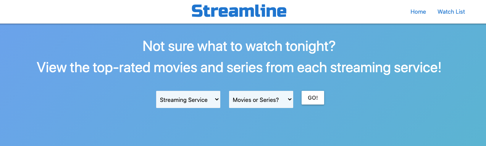

# Description

This was a group project in my web dev bootcamp class. The purpose of the project was to use server-side APIs to create a functional application. 

## Project Details

<strong>TITLE</strong>  
Streamline

<strong>USER STORY</strong>  
I'm not sure what to watch tonight, so I want to view recommendations on the best movies or series available on various streaming services.

<strong>DETAILS</strong>
* When a user selects their streaming service and media type, they are presented with the top 10 results from IMDB. 
* The user can click to view more information for each movie/series, such as the release date, cast & crew, and synopsis.
* The user can also save a movie/series to their Watch List.
* The Watch List uses local storage to store and display the user's saved titles.

# Live Application
https://mrpancakes.github.io/streaming-service-api/

